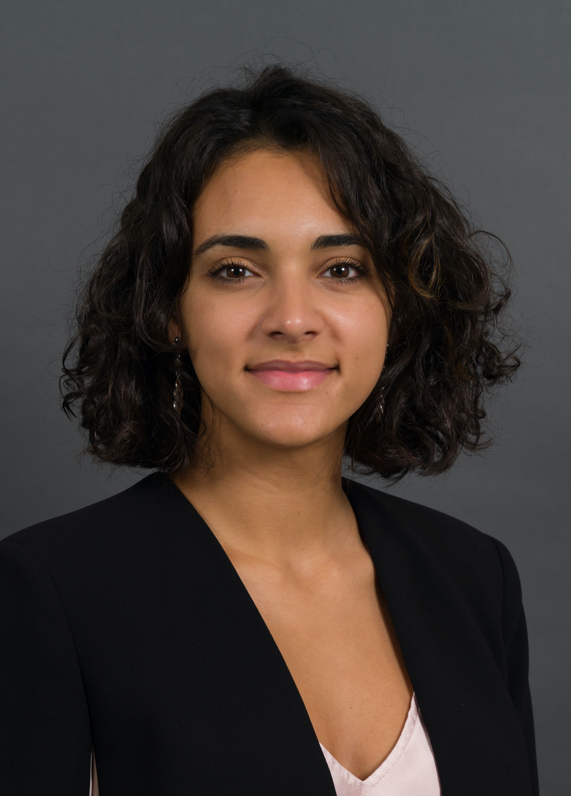

We are three master students and a PhD student from EPFL passionate about social sciences etc etc.

| Mattia Atzeni | Laura Cabizzosu | MArcel Granero | Cameron Smith |
| :------ |:--- | :--- | :--- |
| Photo??? |   |  |Photo???| 
| Electrical Engineer | Bioengineer | Data Scientist | Bioengineer |

alt="drawing"

### Our Story
 
Our group is called *Musetti ADAletti* because we are following the intense course of Applied Data Analysis (ADA in short) and because we are passionate about animals. Two of us are from Italy, one speaks fluently italian and the others wants to learn it. What better way to combine cute animals and love for italians and italy than take as a mascotte the Italian Instagram page of [Musetti Animaletti](https://www.instagram.com/musetti_animaletti/?hl=en)?

Check out the instagram page of these cute pets! You will understand why we choose these mascottes.

