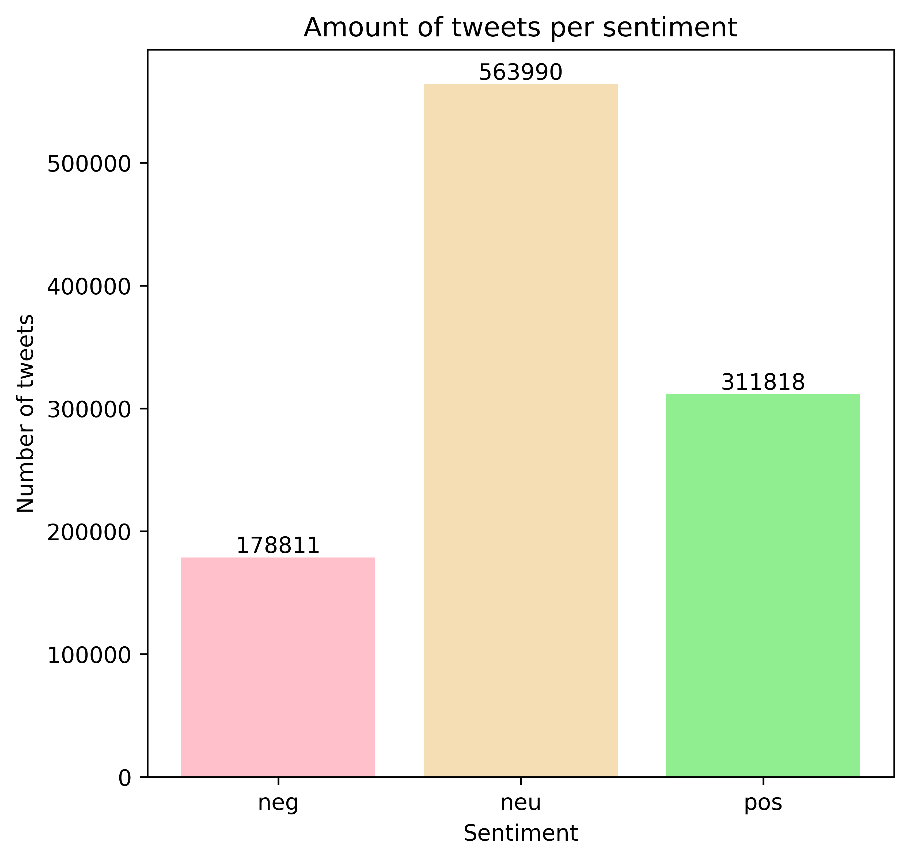

The results you are seeing are based on a follow up of a paper from [Hai Liang and King-wa Fu](https://journals.plos.org/plosone/article?id=10.1371/journal.pone.0134270). These scientists had the double aim of generalizing and testing ten propositions made in previous Twitter studies and developing an adequate and replicable sampling method to study computational social sciences. We used the same tweeter user IDs and we extracted tweets text using Twitter APIs. We took the dataset used in the mentioned paper containing the IDs for each tweet and extracted these IDs to a text file; only tweet IDs associated with english were kept. Then, we ran the tweet IDs through [Hydrator](https://github.com/DocNow/hydrator) to extract the text from each tweet. The output of the Hydrator was a JSON file containing most of the same information as in the timelines data used by the paper, but with the text of each tweet as well. After the hydrator, we kept around 66% of the tweets which amounted to 1.6 million tweets. Once we had the text of the tweets, there were still tweets that were still not in english, so we eliminated those tweets and ended with 1.1 millions tweets. 

The tweets collected have been cleaned up and preprocessed with complex and annoying natural language python toolkits, but dont't we will not annoy you with those. Everything went well though, trust us.

We labeled the tweets based on the sentiment they convey, as either ```positive```, ```neutral``` or  ```negative```.
We used two sentiment-analysis models for this purpose:
* the [Vader sentiment analyzer](https://github.com/cjhutto/vaderSentiment) is a rule-based model published by [C.J. Hutto and Eric Gilbert (2014)](https://www.aaai.org/ocs/index.php/ICWSM/ICWSM14/paper/view/8109/8122).
* [BERT](https://arxiv.org/abs/1810.04805) is a more recent language model based on a large neural architecrture that can be fine-tuned for sentiment-analysis tasks.

Vader assings a sentiment score to the text of each tweet, and then we can distinguisch ```positive```, ```negative``` and ```neutral``` tweets by setting a threshold on this score. The following plot shows the sentiment distribution as predicted by Vader.

<span style="display:block;text-align:center"> {:height="500" width="500"} </span>

The sentiment-analysis model based on BERT is fine-tuned on a dataset with only ```positive``` and ```negative``` tweets. We applied this model on the ones labeled by Vader as non-neutral and we obtained the following distribution.

<span style="display:block;text-align:center"> {:height="500" width="500"} </span>

We see that the distribution of positive and negative tweets can be different depending on the model. Let's look in more details at the difference between the predictions made by BERT and Vader. The following plot shows the percentage of tweets that fall under each of the four possible combinations of label assingments by the two models.

<span style="display:block;text-align:center"> {:height="500" width="500"} </span>

We see that, overall, the two models agree for approximately 70% of the tweets in the dataset.

In order to maximize the precision of the labeling of ```positive``` and ```negative``` tweets, we consider a tweet as ```positive``` or ```negative``` only if the two models agree. In case of disagreement, the tweet is be labeled as ```neutral``` and will be disregarded in our analysis.

This yields the final distribution depicted in the plot below.


<span style="display:block;text-align:center"> {:height="500" width="500"} </span>

